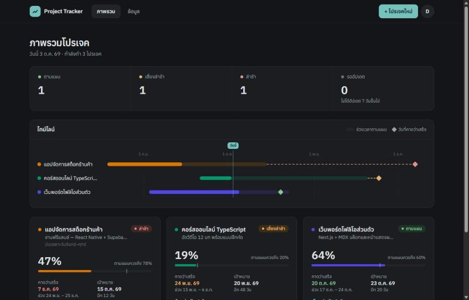
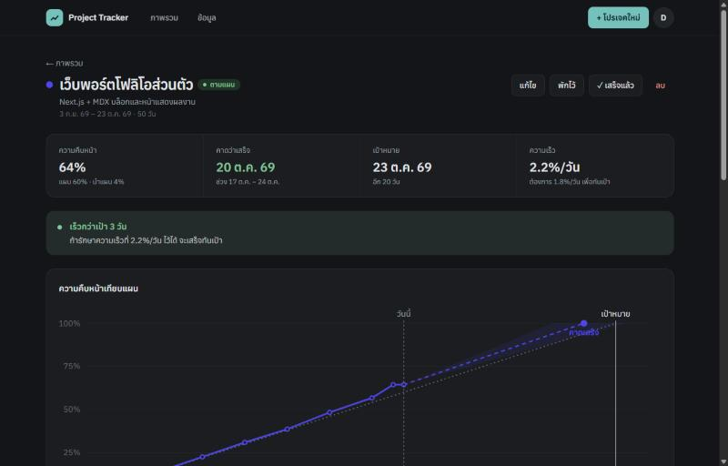
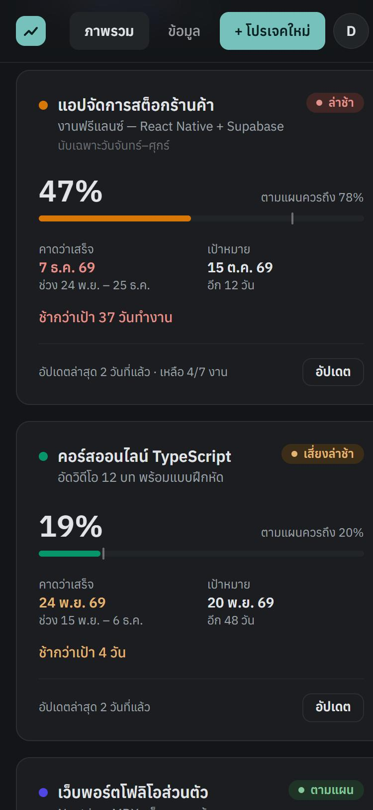
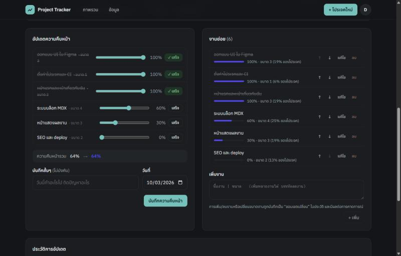
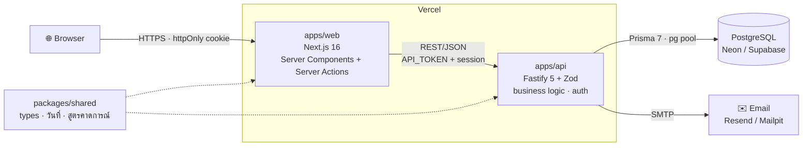

<div align="center">

# 📈 Project Tracker

**ติดตามหลายโปรเจคพร้อมกัน — รู้ว่าจะเสร็จวันไหน และคลาดจากแผนแค่ไหน**

เว็บแอป full-stack ที่คาดการณ์วันเสร็จจากความเร็วการทำงานจริง พร้อมระบบบัญชีผู้ใช้ และพร้อม deploy ขึ้น Vercel


[ฟีเจอร์](#-ฟีเจอร์) · [เริ่มใช้งาน](#-เริ่มใช้งานในเครื่อง) · [สถาปัตยกรรม](#-สถาปัตยกรรม) · [Deploy](#-deploy) · [เอกสาร](#-เอกสาร)



</div>

---

## 🎯 ปัญหาที่แก้

เวลาทำหลายโปรเจคพร้อมกัน คำถามที่ตอบยากที่สุดไม่ใช่ "ทำไปกี่ %" แต่คือ

- **จะเสร็จจริงวันไหน** ถ้ายังทำด้วยความเร็วแบบนี้?
- **ทันเป้าไหม** — ถ้าไม่ทัน ช้ากี่วัน และต้องเร่งแค่ไหน?
- **โปรเจคไหนควรโฟกัสก่อน** ตอนนี้?

Project Tracker ตอบคำถามเหล่านี้จากประวัติการอัปเดตจริง แทนการเดา — ยิ่งอัปเดตบ่อย การคาดการณ์ยิ่งแม่น

## ✨ ฟีเจอร์

| | |
|---|---|
| **คาดการณ์วันเสร็จ** | จากความเร็วจริง (ผสมความเร็วรวม + 14 วันล่าสุด) พร้อมช่วง "เร็วสุด–ช้าสุด" |
| **สถานะอัตโนมัติ** | ตามแผน · เสี่ยงล่าช้า · ล่าช้า — พร้อมบอกว่าต้องเร่งเป็นกี่ %/วัน จึงจะทัน |
| **งานย่อยถ่วงน้ำหนัก** | ความคืบหน้าคิดตาม "ขนาด" ของแต่ละงาน · เพิ่ม/ลบงานกลางทางถูกบันทึกเป็น *ขอบเขตเปลี่ยน* |
| **ไม่นับเสาร์–อาทิตย์** | เลือกได้ต่อโปรเจค — แผน ความเร็ว และวันเสร็จคิดเป็นวันทำงาน |
| **ภาพรวมหลายโปรเจค** | ไทม์ไลน์รวม · เรียงโปรเจคที่ต้องใส่ใจก่อน · เตือนเมื่อไม่ได้อัปเดต 7 วัน |
| **กราฟ burn-up** | ความคืบหน้าจริง vs แผน vs คาดการณ์ (SVG ฝั่ง server) |
| **บัญชีผู้ใช้** | สมัคร · ยืนยันอีเมล · เข้าสู่ระบบ · ลืมรหัสผ่าน · เข้าสู่ระบบด้วย Google (ไม่บังคับ) — ข้อมูลแต่ละคนแยกกัน |
| **สำรอง / กู้คืน** | ดาวน์โหลดและกู้คืนข้อมูลทั้งหมดเป็น JSON |
| **ใช้งานได้ทุกจอ** | Responsive ถึง 360px · Dark mode ตามระบบ · UI ภาษาไทย วันที่แบบ พ.ศ. |

<table>
  <tr>
    <td width="62%"></td>
    <td width="38%" rowspan="2"></td>
  </tr>
  <tr>
    <td></td>
  </tr>
</table>

### การคาดการณ์ทำงานอย่างไร

```
ความเร็ว        = ½ × (ความเร็ว 14 วันล่าสุด) + ½ × (ความเร็วตั้งแต่เริ่ม)      [%/วัน]
วันคาดว่าเสร็จ  = วันนี้ + ⌈ (100% − ความคืบหน้า) ÷ ความเร็ว ⌉
ความคลาดเคลื่อน = วันคาดว่าเสร็จ − วันเป้าหมาย
```

ความเร็วล่าสุดทำให้วันเสร็จขยับทันทีเมื่องานช้าลง ส่วนความเร็วรวมกันไม่ให้แกว่งจากการอัปเดตครั้งเดียว — รายละเอียดทั้งหมดและเกณฑ์สถานะอยู่ใน [SRS §5](docs/SRS.md#5-อัลกอริทึมการคาดการณ์)

## 🏗 สถาปัตยกรรม



- **Browser คุยกับ web เท่านั้น** — web เรียก API จากฝั่ง server จึงไม่เปิดเผย URL หรือ token ของ API
- **API เป็นเจ้าของ business logic ทั้งหมด** — ตรวจข้อมูลด้วย Zod, ทำงานใน transaction, กรองข้อมูลตามเจ้าของทุก query
- **สูตรคาดการณ์เป็น pure function** ใน `packages/shared` — ใช้ร่วมกันทั้งสองฝั่งและ test ได้โดยไม่ต้องมีฐานข้อมูล

### Tech stack

| ส่วน | เทคโนโลยี |
|---|---|
| Frontend | Next.js 16 (App Router, Turbopack), React 19, Tailwind CSS 4 |
| Backend | Fastify 5 บน Node.js 24 (รัน TypeScript โดยตรง ไม่ต้อง build), Zod 4 |
| Database | PostgreSQL 17, Prisma 7 + `@prisma/adapter-pg` |
| Auth | Session token (เก็บแค่ SHA-256), scrypt, email verification, Google OAuth (code + PKCE), rate limiting บน Postgres |
| Email | Nodemailer — Mailpit ตอนพัฒนา, SMTP จริงตอน production |
| Testing | Vitest — unit (สูตรคาดการณ์) + integration (HTTP → Postgres จริง) |
| Infra | npm workspaces, Docker Compose, GitHub Actions, Vercel |

### โครงสร้างโปรเจค

```
.
├── apps/
│   ├── web/                    # Next.js
│   │   ├── app/(app)/          #   หน้าที่ต้องเข้าสู่ระบบ: แดชบอร์ด, โปรเจค, ข้อมูล
│   │   ├── app/(auth)/         #   login, register, verify-email, forgot/reset password
│   │   ├── components/         #   UI, กราฟ SVG, ฟอร์ม
│   │   ├── lib/                #   api.ts (client), actions.ts, auth-actions.ts, session.ts
│   │   └── proxy.ts            #   ส่งผู้ที่ยังไม่เข้าสู่ระบบไป /login
│   └── api/                    # Fastify
│       ├── src/server.ts       #   entry point
│       ├── src/create-app.ts   #   routes + error handling
│       ├── src/service.ts      #   business logic (scoped ตามผู้ใช้)
│       ├── src/auth/           #   บัญชี, รหัสผ่าน, อีเมล
│       └── prisma/             #   schema.prisma + migrations
├── packages/shared/            # types, วันที่/วันทำงาน, สูตรคาดการณ์, สัญญา API
├── docs/                       # SRS, คู่มือ deploy, ภาพหน้าจอ
├── docker-compose.yml          # PostgreSQL + Mailpit สำหรับพัฒนา
└── .env.example                # ตัวแปรทั้งหมดในที่เดียว
```

## 🚀 เริ่มใช้งานในเครื่อง

**ต้องมี:** Node.js 24+ และ Docker Desktop

```bash
npm install
npm run setup:env   # สร้าง apps/api/.env และ apps/web/.env.local พร้อม API_TOKEN ที่ตรงกัน
npm run dev         # เริ่ม PostgreSQL + Mailpit (Docker), apply migrations, รัน api + web
```

| | URL |
|---|---|
| เว็บแอป | http://localhost:3000 |
| API (health check) | http://127.0.0.1:4000/health |
| กล่องอีเมล (Mailpit) | http://localhost:8025 |

1. สมัครที่ http://localhost:3000/register
2. เปิด **Mailpit** แล้วกดลิงก์ยืนยันอีเมล
3. กด **"ลองด้วยข้อมูลตัวอย่าง"** เพื่อดูระบบพร้อมข้อมูล 3 โปรเจค

<details>
<summary>ตัวแปรสภาพแวดล้อม</summary>

ดูทั้งหมดพร้อมคำอธิบายใน [`.env.example`](.env.example) — ตัวที่จำเป็นใน production:

| ไฟล์ | ตัวแปร |
|---|---|
| `apps/api/.env` | `DATABASE_URL`, `API_TOKEN`, `APP_URL`, `SMTP_URL` |
| `apps/web/.env.local` | `API_URL`, `API_TOKEN` |

API ตรวจค่าตอนเริ่มทำงาน — ถ้าตั้งไม่ครบหรือไม่ปลอดภัยใน production จะไม่ยอมเริ่มและบอกว่าค่าไหนผิด
</details>

### คำสั่ง

| คำสั่ง | หน้าที่ |
|---|---|
| `npm run dev` | พัฒนา (hot reload ทั้ง web และ api) |
| `npm run build` · `npm start` | build และรันแบบ production |
| `npm test` | unit + integration test ทั้งหมด |
| `npm run typecheck` · `npm run lint` | ตรวจ type และ lint |
| `npm run db:migrate` | สร้าง migration หลังแก้ `schema.prisma` |
| `npm run db:studio` | เปิด Prisma Studio ดู/แก้ข้อมูล |
| `npm run db:up` · `npm run db:down` | เปิด/หยุด Docker (Postgres + Mailpit) |
| `npm run db:import-json` | นำเข้าไฟล์สำรอง JSON เข้าบัญชี |

## 🧪 การทดสอบ

```bash
npm test
```

**46 tests** — integration test ยิง HTTP เข้า API จริงและอ่าน/เขียน PostgreSQL จริง (ฐานข้อมูล `tracker_test` แยกจากข้อมูลพัฒนา) ครอบคลุม:

- สูตรคาดการณ์ทุกสถานะ, วันทำงาน, time zone
- สมัคร → ยืนยันอีเมล → เข้าสู่ระบบ → ลืมรหัสผ่าน → ตั้งรหัสใหม่ (อ่านลิงก์จากอีเมลที่ระบบส่ง)
- **การแยกข้อมูลระหว่างผู้ใช้** — ผู้ใช้อื่นอ่าน/แก้/ลบข้อมูลของเราไม่ได้
- rate limit ใช้ร่วมกันข้าม instance, การไม่เปิดเผยว่าอีเมลไหนมีบัญชี, การเก็บเวลาแบบ UTC

CI บน GitHub Actions รัน typecheck, lint, test (กับ Postgres service) และ build ทุก push

## 🔐 ความปลอดภัย

- รหัสผ่าน hash ด้วย **scrypt** · ฐานข้อมูลเก็บแค่ **SHA-256** ของ session และลิงก์ในอีเมล
- Session ใน cookie **httpOnly · SameSite=Lax · Secure** · ลิงก์ยืนยัน/ตั้งรหัสใช้ได้ครั้งเดียวและมีอายุ
- **ไม่เปิดเผยว่าอีเมลไหนมีบัญชี** ทั้งตอนสมัคร เข้าสู่ระบบ และลืมรหัสผ่าน
- **Rate limit** ต่อ IP เก็บใน Postgres (เก็บเป็น hash ไม่เก็บ IP ตรงๆ) · ส่งอีเมลซ้ำได้ทุก 60 วินาที
- ทุก query กรองตามเจ้าของ และ service **ปฏิเสธการเรียกที่ไม่มี user id** (กัน Prisma ตีความ `undefined` เป็น "ทุกแถว")
- API ป้องกันด้วย shared token (เทียบแบบ timing-safe) · security headers (HSTS, X-Frame-Options, nosniff ฯลฯ)

## ☁️ Deploy

Deploy เป็น **2 โปรเจคบน Vercel** (`apps/web`, `apps/api`) + PostgreSQL (Neon/Supabase) + SMTP (เช่น Resend)

- Migration รันอัตโนมัติเฉพาะ **production deploy** (preview ไม่แตะฐานข้อมูลจริง)
- Connection pool ปรับสำหรับ serverless (`attachDatabasePool`) และ rate limit ใช้ร่วมกันทุก instance
- `APP_TIMEZONE` กำหนดว่า "วันนี้" คือวันไหน (server ของ Vercel ใช้ UTC)

ขั้นตอนทีละข้อ พร้อมรายการตรวจหลัง deploy: **[docs/DEPLOY.md](docs/DEPLOY.md)**

## 📚 เอกสาร

| เอกสาร | เนื้อหา |
|---|---|
| [docs/SRS.md](docs/SRS.md) | Software Requirements Specification — ความต้องการ (MoSCoW), อัลกอริทึม, data model, API |
| [docs/DEPLOY.md](docs/DEPLOY.md) | คู่มือ deploy ขึ้น Vercel |
| [.env.example](.env.example) | ตัวแปรสภาพแวดล้อมทั้งหมด |

## 💡 สิ่งที่ได้เรียนรู้

ปัญหาจริงที่เจอระหว่างพัฒนา และวิธีแก้:

- **Timezone ของ Postgres ทำให้เวลาเพี้ยน 7 ชั่วโมงแบบเงียบๆ** — pg adapter ของ Prisma ส่งเวลาเป็น UTC โดยไม่มี offset ถ้า session ของฐานข้อมูลเป็น `Asia/Bangkok` ทุกค่าจะถูกเก็บผิด แต่แอปดูปกติเพราะตอนอ่านกลับมาหักล้างกันพอดี → บังคับฐานข้อมูลเป็น UTC, API เตือนตอนเริ่ม, และมี test จับ (ลองสลับกลับเป็นเวลาไทยแล้ว test fail ที่ส่วนต่าง 7 ชั่วโมงจริง)
- **`where: { userId: undefined }` ใน Prisma หมายถึง "ไม่กรอง"** — บั๊กเล็กๆ ที่ลืมส่ง user id อาจลบข้อมูลของทุกคน → ครอบ service ทั้งหมดให้ปฏิเสธการเรียกที่ไม่มี user id ที่ถูกต้อง
- **Rate limit ในหน่วยความจำใช้ไม่ได้บน serverless** — แต่ละ instance นับแยกกัน → เขียน store บน Postgres ด้วย atomic upsert และ test ด้วย 2 instance
- **`window.confirm()` ไม่ทำงานใน embedded browser บางตัว** (คืน `false` ทันทีโดยไม่แสดงอะไร) และ event `close` ของ `<dialog>` ก็ไม่ยิง → ทำ dialog ยืนยันเอง และจัดการจากปุ่มโดยตรง
- **"วันนี้" ไม่ควรมาจากนาฬิกา server** — บน Vercel (UTC) ช่วงเที่ยงคืนถึงตีเจ็ดเวลาไทยจะเป็น "เมื่อวาน" → ใช้ `APP_TIMEZONE` กับ `Intl.DateTimeFormat`
- **Vercel ตรวจหา entry ของ Fastify จากชื่อไฟล์** และ `src/app.ts` มาก่อน `src/server.ts` → เปลี่ยนชื่อเป็น `create-app.ts` และเขียนโค้ดแบบ *erasable syntax only* ให้รันบน Node 24 ได้โดยตรงโดยไม่ต้อง build

## 🗺 Roadmap

- [ ] วันหยุดนักขัตฤกษ์ / วันลาในปฏิทินวันทำงาน
- [ ] แจ้งเตือนทางอีเมลหรือ LINE เมื่อโปรเจคเสี่ยงล่าช้าหรือไม่ได้อัปเดตนาน
- [ ] Milestone ย่อยที่มี deadline ของตัวเอง
- [ ] ติดตามความแม่นของการคาดการณ์ย้อนหลัง (forecast drift)
- [x] เข้าสู่ระบบด้วย Google
- [ ] 2FA

## 📄 License

[MIT](LICENSE) © 2026 Anupong Pakee
